# Writing your own CSS-only Games #
## Part 1: Counters

CSS is not a programming language. Not _officially_. But it [is possible to create games with only HTML and CSS](https://www.youtube.com/watch?v=-e5nWsGgZXQ). And there are even some tutorials on how to make a specific game: [a click 'em all](https://medium.com/cssclass-com/how-to-create-pure-css-games-2a29c777bf4), [a jigsaw](https://css-tricks.com/how-i-made-a-pure-css-puzzle-game/), [a maze](https://scriptraccoon.dev/blog/create-css-maze), and maybe more that I have not found.

My aim here is different. In this series of articles, I want to get you to experiment with the different techniques that you can use to create your own games. By the end of each article, you won't have created a game, but you will have understood why some things work and some things don't.

In this article, you'll be looking at the following ideas:

1. Using checkboxes and radio buttons to store state
2. Using animations to change state
3. Using `::before` and `::after` pseudo-elements
4. Using `z-index` to reorder elements
5. Using the `:hover` pseudo-class to intercept the actions of the mouse
6. Writing selectors that control the logic
7. **Using custom CSS properties**
8. **Working with counters**

My main focus here will be on the last two ideas: understanding how **CSS custom properties and counters work together**. You need to use counters, after all, to number things: to show the score or to display a timer, for example. These are simple ways to add urgency and excitement to a game. And if you think laterally, you can also get counters to do some quite unexpected things for you, as you will see.

I won't treat the other seven ideas is such great depth here. I'll be writing other articles about them specifically.

###  Starting with questions

Before you start, you can play a little with the CSS-only activities below. Ask yourself these questions:
- How can I create a countdown timer in CSS?
- How can I calculate a score in CSS?
- How is a counter used for the _letters_ in the word game?
- CSS can do arithmetic?
- Yes, OK, it has `calc()`, but how can I get it to show me the results?
- Really!? I can use _counters_ to animate emojis? How soon can I use that in a project?
- How does a counter know where the mouse is?

If you start with questions, each time you find an answer, you get a little buzz of satisfaction. It's like with jokes. If you hear the punchline first, you might think: "When am I ever going to need an answer like this?" If you hear the build-up first, the punchline becomes something you want to share with your friends.

These are not all complete games or puzzles. You can think of them as illustrations of the concepts that you will be reading more about below.

[](https://merncraft.github.io/word/)  
[Link](https://merncraft.github.io/word/)

[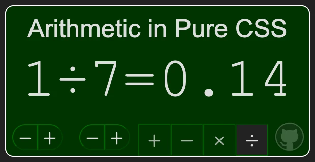](http://MERNCraft.github.io/calc)
[Link](http://MERNCraft.github.io/calc)

[](https://merncraft.github.io/spin/)  
[Link](https://merncraft.github.io/spin/)

[](https://merncraft.github.io/map/)  
[Link](https://merncraft.github.io/map/)

You might also have other questions, like:
- How do I detect when the player has won?
- How do I stop the game when the player's time runs out?
- How do I make an animation glitch?
- How do I ensure that whichever button the player clicks last behaves differently from the others?
- Must I solve the word game to find a link to the repo?
- How do I create that neat revolving reel animation?

Keep these questions in mind. You'll find answers to them in forthcoming tutorials... unless you can create good ~~punchlines~~ answers for yourself first : )

### What I expect you to know already

I'm assuming that you already know how to create an HTML page and link a CSS file to it. I'm assuming that you already understand how to write CSS selectors, and how to structure [nested CSS](https://developer.mozilla.org/en-US/docs/Web/CSS/CSS_nesting/Using_CSS_nesting). Nested CSS has been [available in all major browsers since December 2023](https://caniuse.com/?search=nested%20css), and it's available to over 80% of all users, so it should work in your development browser. It allows me to write shorter CSS code.

If you don't yet know about the recently-introduced `:has()` pseudo-class, don't worry. You'll see plenty of examples on how to use it.


## Learning to Count
### The Origin Story: ordered lists

If you create an `<ol>` ordered list, your browser will automatically number the lines. Try it:
```html
<h1>TO DO LIST</h1>
<ol>
  <li>Buy a tortoise</li>
  <li>Call it 'The Speed of Light'</li>
  <li>Tell people I can run faster than The Speed of Light</li>
</ol>
```
You can change the number that the list starts with by using the `start` attribute in your HTML:
```html
<ol start="10">
  <li>Buy a tortoise</li>
  <li>Call it 'The Speed of Light'</li>
  <li>Tell people I can run faster than The Speed of Light</li>
</ol>
```
  
Figure 1.

This works because under the hood, the browser uses a  [counter](https://developer.mozilla.org/en-US/docs/Web/CSS/CSS_counter_styles/Using_CSS_counters) called `list-item`. You can control this counter through CSS. With the following rule, all your `<ol>` elements will start from `101`... even those where you set the `start` property in your HTML file. The `counter` property takes precedence...
```css
ol {
  counter-set: list-item 101;
}
```
... except that since Google released Chromium 126 on 11 June 2024, this use of `list-item` is broken in Webkit browsers such as Google Chrome, Opera and Microsoft Edge. It still works in Firefox and Safari, so you can test it there. It's not a big deal, because you won't need to use exactly this feature for anything in your CSS-only games. It's just nice to know that ordered `<ol>` lists were where the `counter` feature came from.
### Free for all

Ordered lists don't claim exclusive rights over counters. Browsers make counters available to any element. They give you full control of any kind of numbering process. Here's how you could create a similar (not identical) result using a `<ul>` unordered list.
```html
<ul>
  <li>For the money</li>
  <li>For the show</li>
  <li>To get ready and go cat go</li>
</ul>
```
```css
ul {
  list-style-type: none;
  counter-set: item;

  li {
    counter-increment: item;
  }

  li::before {
    content: "Item " counter(item) ". ";
  }
}
```
The CSS elves see that a `counter` called `item` has been set for the `<ul>` element. By default, they give it the value `0`. They apply the rule `counter-increment: line` each time they meet a new `<li>` item in the list where the `item` counter was set. They then read the current value of `counter(item)` and use this number as the [`content`](https://developer.mozilla.org/en-US/docs/Web/CSS/content) of the [`::before`](https://developer.mozilla.org/en-US/docs/Web/CSS/::before) pseudo-element.

  
Figure 2.

> Note that [you can provide several items](https://developer.mozilla.org/en-US/docs/Web/CSS/content#syntax) in the value for the `content` attribute, like `"Item " counter(item) ". "`, and the CSS elves will concatenate them together for you. 

> Note that I use [`counter-set`](https://developer.mozilla.org/en-US/docs/Web/CSS/counter-set) and not `counter-reset`, because the current version of Firefox (128.0.3) does not always handle `counter-reset` as you would expect it to.

### Unpacking how CSS works

Warning: What I show below is _not good HTML_. You are not supposed to use `<b>` tags inside a `<ul>` list, and there's not a real-life case for leaving them empty. But this makeshift HTML is good enough to show you how the CSS elves work.
```html
<b></b>
<ul>
  <b></b>
  <li>For the money</li>
  <b></b>
  <li>For the show</li>
  <b></b>
  <li>To get ready and go cat go</li>
  <b></b>
</ul>
```
In my first example, I gave no initial value for the `item` counter, so it started with the default value of `0`. The CSS elves then found the first list item ("For the money"), and incremented the `item` counter by the default amount: `1`. So when the first list item was shown, the `content` of its `::before` pseudo-element was "Item 1."

In the CSS below, I create a custom `counter` called `item`, with an initial value of `10`. I also use `counter-increment: item 5;` each time an `<li>` item is treated, so the first item starts with an `item` value of 15.

```css
ul {
  list-style-type: none;
  counter-set: item 10;

  li {
    counter-increment: item 5;
  }

  li::before {
    content: "Item " counter(item) ". ";
  }
}

b::before {
  content: "—[" counter(item) "]—";
}
```
Here's what this looks like:

  
Figure 3.

Notice the values of `counter(item)` that are shown in the `<b>` elements.
- The `item` counter is not available to the first `<b>` element (outside the `<ul>` element where `item` is declared, so it shows the default value of `0`.
- The `<b>` element that appears in the HTML page before the first `<li>` item shows the initial value of `10`.
- The other `<b>` elements show the value for `item` that was accumulated by all the `<list>` items that came before it.


### White space matters
Try adding a new line to the ruleset for the `b::before` selector:
```css
  b::before {
    counter-increment: item+1; /* new line */
    content: "—[" counter(item) "]—";
  }
```

You'll see that the CSS elves also now happily add `1` for each `<b>` element they encounter. Notice that there is no space between `item` and `+1`.

  
Figure 4.

But what if you change the `+` to a`-` sign?

```css
counter-increment: item-1; /* new line */
```

The CSS elves get confused. They think that you are referring to a counter named `item-1`. If you'd used `item-one`, it would have had the same effect. You didn't declare a counter called `item-1`, so they ignore it. The result will be just the same as what you saw in Figure 1.

If you add a white space, then everything is clear again.

```css
counter-increment: item -1; /* altered line */
```

> Note that there is no ~~`counter-decrement`~~ property. You have to increment by a negative number. And a space.

Each `b` element decreases `item` by 1, in each and every case, even outside the `<ul>` where the `item` counter is declared. In effect, the CSS elves are very accommodating. You didn't declare a `counter` for this particular element before you started using it? No worries, they will create one for you implicitly. Browsers are designed to be forgiving, so you can write sloppy code.

And yes, my code here is deliberately sloppy. I find that you learn more about how to write good code if you deliberately try to break the rules, and see what the effect is. [If you always do things perfectly, you don't find out what the rules are](https://www.youtube.com/watch?v=vKA4w2O61Xo).

And, as before, each `<li>` item increases `item` by 5.

  
Figure 5.


## Interacting with the User

A web experience cannot be considered to be a game if it has no user interaction. In this section, you'll be seeing how to use checkboxes, radio buttons and sibling combinators ( [`~`](https://developer.mozilla.org/en-US/docs/Web/CSS/Subsequent-sibling_combinator) and [`+`](https://developer.mozilla.org/en-US/docs/Web/CSS/Next-sibling_combinator) ) to change what the CSS is counting, depending on what the user clicks on.

### Not on display

The CSS elves will only count what they can see. You can try to trick them with another sloppy line of HTML:
```html
  <ul>
    <b></b>
    <li>For the money</li>
    <b></b>
    <input type="checkbox"> <!-- Linters don't like this in a <ul> -->
    <li>For the show</li>
    <b></b>
    <li>To get ready and go cat go</li>
    <b></b>
  </ul>
```

And you can add a new rule that will hide the `<li>` item immediately after the checkbox when you check it.

(Note that I've also removed the `counter-increment: item -1;` from the `b::before` ruleset, to keep things simple.)
```css
ul {
  list-style-type: none;
  counter-set: item 10;

  li {
    counter-increment: item 5;
  }

  li::before {
    content: "Item " counter(item) ". ";
  }

  /* New rule */
  input:checked + li {
    display: none;
  }
}

b::before {
  content: "—[" counter(item) "]—";
}
```

What do you think will happen when you click on the checkbox?

  
Figure 6.

If an element is not displayed, then no counter will count it.

However, if you simply hide a list item, like this...

```css
  /* New rule */
  input:checked + li {
    visibility: hidden; /* new rule */
  }
```

... then the CSS elves _do_ count it:

  
Figure 7.

So here's a trick that you can use: You can set the `display` value of certain HTML elements to `none` if particular checkboxes or radio buttons are `checked`. The CSS elves will not count the elements with `display: none`, so you can display the number of such elements that are visible.

### Time to play: counting clicks

If all this makes sense to you, the perhaps you'd like to create a really simple activity. (If it doesn't make sense, then you can go back and read the links that I provided for each new concept, and you try to make different mistakes to irritate your browser, until you can work out what rules it really wants you to follow.)

This time, you can leave lists behind, and count checkboxes directly.

You can create an new HTML file and give it these elements:
```html
  <label>
    <input type="checkbox">
    <span></span>
  </label>
  <label>
    <input type="checkbox">
    <span></span>
  </label>
  <label>
    <input type="checkbox">
    <span></span>
  </label>
  
  <p>You have clicked on <span>/</span> circles.</p>
```

Attach a CSS stylesheet with the following rules:

```css
body {
  counter-set: total;
}

label span {
  --size: 25vh;
  display: block;
  width: var(--size);
  height: var(--size);
  border-radius: var(--size);
  background-color: gold;
  opacity: 0.1;

  counter-increment: total;
}  

input:checked ~ span {
  opacity: 1;
}

p span::before {
  content: "0"
}

p span::after {
  content: counter(total)
}
```

Before you launch your new web page, do your best to predict what you will see.
- Each `<label>` contains both a checkbox and a `<span>`. This means that the `<span>` is part of the  `<label>`, and a click on this `<span>` inside the  `<label>` will toggle the checkbox.
- The [`~` sibling combinator](https://developer.mozilla.org/en-US/docs/Web/CSS/Subsequent-sibling_combinator) in the selector `input:checked ~ span` selects a span only when a preceding `<input>` sibling has been checked. When a checkbox is checked, the `opacity` of the associated gold circle will be set to `1`. When the checkbox is not checked, the gold circle will appear dim.
- There are different rulesets for the  `<span>` elements inside a `<label>` and for  the `<span>` inside the  `<p>` element. This is because they are used for different purposes.
* The [custom CSS property](https://developer.mozilla.org/en-US/docs/Web/CSS/Using_CSS_custom_properties) `--size` allows you to set one value that is used for the `width`, `height` and `border-radius` of all the `<span>` elements which are inside `<label>` elements. This means that the `<span>`s will be round. 
* There is a `counter` called `total` which starts with a default value of `0`. Each `<label>` element increments this value by the default increment of `1`. There are three `<label>` elements, so the final value of `total` should be 3.
* The `<span>` inside the `<p>` element contains only a `/` slash, but the CSS adds both `::before`  and `::after` pseudo-elements to it.

You should see three pale gold circles, each with a checkbox at its top left, and text at the bottom of your page should say: "You have clicked on 0/3 circles." You can click on the checkboxes and circles as much as you like, but the final sentence will not change.

  
Figure 8.

The value `3` appears because of this rule:
```css
p span::after {
  content: counter(total)
}
```
Can you imagine how to add another `counter` that will count how many `<input>` elements have been checked? Can you imagine how to display  the value of this new `counter` in the `::before` pseudo-element of the `<p>` element?

Can you do it on your own, without reading the solution below?

#### Solution

Here are the lines of CSS that I changed or added in my version, in order to make this feature work:

```css
body {
  counter-set: total clicked;
}

input:checked {
  counter-increment: clicked;
}

p span::before {
  content: counter(clicked)
}
```
  
Figure 9.

>Note: You might think that declaring each `counter` on a different line might be valid CSS...
```css
body {
  counter-set: total;
  counter-set: clicked;
}
```
>... and it _is_ valid, but it doesn't behave the way you might expect. The second `counter-set` property overwrites the first, so `counter-set: total;` will be ignored.

This is the way CSS works for all other properties. In this ruleset...
```css
label span {
  background-color: gold;
  background-color: silver;
}
```
... the `silver` background will overwrite the `gold`, just as you would expect.

If you want to declare different `counter` properties on different lines, just use a single semicolon at the end of the multi-line rule:
```css
body {
  counter-set:
    total
    clicked;
}
```
Now when you click on a gold circle, or on its checkbox, the number shown in the `::before` pseudo-element changes.

### One-way clicking

If you click on the same gold circle a second time, the checkbox will be deselected, and the number of "clicked" circles will go down. What is the simplest way to ignore any subsequent clicks?

In a group of radio buttons, only one radio button can be checked at any given time. Clicking on that button again does not uncheck it. If you have a group with only one radio button in it, then you can switch it from unchecked to checked, but you can't toggle it back. Initially, a group of radio button does not need to have any buttons checked. This means that when you use radio buttons, the initial state can have all the buttons unchecked, just like you can do with checkboxes.

To test this, change the `type` of each `input` from `checkbox` to `radio` and refresh your page.
```html
<label>
    <input type="radio">
    <span></span>
  </label>
  <label>
    <input type="radio">
    <span></span>
  </label>
  <label>
    <input type="radio">
    <span></span>
  </label>
  
  <p>You have clicked on <span>/</span> circles.</p>
```
Now only the first click on a gold circle will have any effect, and the number of "clicked" circles cannot decrease.

### Who keeps order?

If you follow my instructions perfectly, your web page should work. But if it works, what exactly have you learnt? You have definitely learnt to follow instructions, but you probably knew how to do that already.

So what if you deliberately do something different, something disruptive, something that I didn't ask you to do? For example: what would happen if you put the "You have clicked on ... circles" message at the _beginning_ of your HTML page?

And just as a double-check, you can add a new line between the second and the third label, like this:
```html
  <p>You have clicked on <span>/</span> circles.</p> <!-- Now at the top -->
  
  <label>
    <input type="radio">
    <span></span>
  </label>
  <label>
    <input type="radio">
    <span></span>
  </label>
  <p><span>/</span> so far</p> <!-- new line -->
  <label>
    <input type="radio">
    <span></span>
  </label>
```
Suddenly, your message insists "You have clicked on 0/0 circles", no matter how hard you click. The new line you have inserted fails to count the circle in the layer above it, or any clicks on that circle.

But were you really being disruptive? Or were you just following instructions again? I wasn't watching.

> Notice how I use the word "above" in the text above. The third circle is shown on the screen _below_ the other two, and lower down in the HTML file. However, it is _drawn_ in a layer that covers the circles that appear earlier in the HTML file. In the _z-direction_ —from the screen to your eye— it is _above_ the other circles, even if in the y-direction, it is closer to the bottom of your screen.
> 
> You can see what I mean if you add this rule at the end of your file:
> ```css
>  label:last-of-type span {
    position: relative;
     top: -10vh;
     border: 10px solid red
   }
> ```
> 
> Figure 10.
> 
> So yes, in one sense, the bottom circle is "above" the others.

From the test that you did above, you can deduce that **the order in which elements appear _in the HTML file_ affects the order in which they can increment a `counter`**.

But what about the order of rules in the CSS stylesheet? What happens if you change the order in which the `counter` properties are set and read, as shown below?
```css
/* Read the value of the counter properties... */
p span::before {
  content: counter(clicked)
}

p span::after {
  content: counter(total)
}

/* ...before you declare the counter properties */
body {
  counter-set:
    total
    clicked;
}

/* The CSS below is unchanged */
label span {
  --size: 25vh;
  display: block;
  width: var(--size);
  height: var(--size);
  border-radius: var(--size);
  background-color: gold;
  opacity: 0.1;

  counter-increment: total;
}

input {
  position: absolute;
  left: -999px;
}

input:checked {
  counter-increment: clicked;
}

input:checked ~ span {
  opacity: 1;
}
```
Does this solve the problem that you just created? No. But if you place a copy of the  element `<p>You have clicked on <span>/</span> circles.</p>` back at the end, everything works fine,  at least in this final position. This _suggests_ that the order in which rules appear _in the CSS file_ **does not** affect the order in which a `counter` is incremented.

But don't let this give you a false sense of security. As Mr Weasley said: "Never trust something that can think for itself if you can't see where it keeps its brain."

  
Figure 11.

### Checking it twice

Whenever I am following a tutorial to learn a new technique, I do the tutorial twice. The first time, I follow the instructions carefully, so that I can see that the results are what the writer promised. 

> Sometimes, tutorials contain errors — a missing step, a missing line, a missing semicolon — and sometimes the technology has changed since the tutorial was written, and instructions that used to work no longer do. When I encounter a tutorial like this, I find that it is often worth persisting, and searching online for solutions. The process of searching is where a lot of my learning happens.

The second time I do the tutorial, I try not to read it at all. I do as much as I can from memory, and inevitably I make mistakes because there is something that I did not understand, or did not pay attention to, or assumed that I could ignore. I don't _mean_ to be disruptive. I just allow disruption to happen.

It is the mistakes that I make the second time that show me how much I still have to learn. If I don't make these mistakes, I can deceive myself into thinking that I have understood. Solving my mistakes takes effort (especially if I don't look back at the tutorial). And something that you have made an effort to do is something that you will remember. 

An app that works perfectly the first time is less helpful than an app where I have to struggle to get it to work.
### Traffic Lights, anyone?

This arrangement of three circles, one above the other, might make you think of traffic lights. And you might be tempted now to get distracted and see if you can create a set of interactive traffic light with only CSS. 

And why not? It's fun to play, and play is great for learning.

The sequence of traffic lights is not the same in every country. Here's a CSS-only illustration of the traffic light sequences in France and in the UK.

[](https://merncraft.github.io/traffic-lights/)  
[Link](https://merncraft.github.io/traffic-lights/)

If you want to try this yourself, here's a hint: You'll be placing a checkbox `<input>` and a `<span>` inside a `<label>` for each light, as you have just been doing, but the `<span>` inside (at least) one label will need a `z-index` setting, so that a click on this `<span>` will check a radio button in a lower layer.

But _this_ article is about **counting** and you won't need to count anything with traffic lights. So when you are ready, perhaps you would like to continue?

### Custom CSS properties

You can also use [custom CSS properties](https://developer.mozilla.org/en-US/docs/Web/CSS/--*)  to hold numbers. To create custom CSS property, you use a property name that starts with `--x`, where "x" is any letter.

I've already used a custom CSS property to set the diameter of the circles in the last example:
```css
label span {
  --size: 25vh;
  display: block;
  width: var(--size);
  height: var(--size);
  border-radius: var(--size);
  /* more lines skipped */
}
```
A custom property lets you define a value once, and use it in many places. It helps you follow the DRY principle: Don't Repeat Yourself. If you decided that you wanted circles of a different size, you could simply change the value of `--size`, in just one place, and the `width`, `height` and `border-radius` properties would all adjust their values.

#### My Opinion on the Term ~~CSS Variables~~

Some people use the term `CSS variables` as a synonym for custom properties. But I don't.

In a programming language, a _variable_ can have various values at different times. And so can custom properties. But:

- A custom CSS property is often reset to its initial value, as you will see in a moment
- You can't display the value of a custom CSS property in the `content` property of a `::before` or `::after` element
- A custom CSS property cannot be used recursively, to reset its value to a value calculated from itself, as the next demonstration shows.

In JavaScript, you can do this, and the JavaScript elves know how to handle it:
```javascript
var x = 1
x = x * 2
```
After these two lines of code have been executed, `x` will have the value `2`.

In CSS, you can set a custom property to a different value. This works fine:
```css
label span {
  --size: 25vh;
  --size: 15vh;
  display: block;
  width: var(--size);
  height: var(--size);
  border-radius: var(--size);
  /* more lines skipped */
}
```
But in the snippet below, the second rule causes the CSS elves to panic, as if they see themselves in an [infinity mirror](https://en.wikipedia.org/wiki/Infinity_mirror). They simply stop working for you.
```css
label span {
  --size: 25vh;
  --size: calc(0.6 * var(--size));
  display: block;
  width: var(--size);
  height: var(--size);
  border-radius: var(--size);
  /* more lines skipped */
}
```
Try both of these changes in the clicking-on-circles exercise that you have just done. 

Custom CSS properties do not behave like variables do in other languages. So _I_ always say "custom CSS ***properties***", to make this distinction clear. But if you call them "CSS variables", I won't say anything. I'll just sigh.

Here is the official explanation of this, without any reference to CSS elves: [Resolving Dependency Cycles](https://www.w3.org/TR/css-variables-1/#cycles)

### Setting a starting value for a counter

To explore how custom CSS properties can interact with counters, create a new HTML file with the following body:
```html
  <b></b>
  <p>Tinker</p>
  <p>Tailor</p>
  <p>Soldier</p>
  <p>Sailor</p>
  <hr>
  <label>
    Add 10: <input id="add10" type="checkbox">
  </label>
  <label>
    Add 100: <input id="add100" type="checkbox">
  </label>
  <label>
    Add 1000: <input id="add1000" type="checkbox">
  </label>
```
Here's a challenge: Before you read on, can you use everything you have learnt so far about CSS counters to write the CSS that will make your page look like this?


Figure 12.  

**DON'T READ ANY FURTHER UNTIL YOU HAVE WRITTEN YOUR OWN CSS.**

Are you ready now? Or are you being disruptive, like I suggested you should be?

Did you write something like this?
```css
body {
  counter-set: item 
}

b::before {
  content: "—[" counter(item) "]—";
}

p {
  counter-increment: item;
}

p::before {
  content: counter(item) ": ";
}

label {
  display: block;
}
```
I imagine that:
- You chose a different name for your counter
- You might have given it an initial value and an explicit increment value
- Your rules might be in a different order.

That's good. It means that you won't be able to simply copy and paste the CSS that I provide below. You'll have to adapt it to work with your property names. You'll have to make an effort : )

### Activating the inputs

To activate the checkboxes, can you do these three steps?
1. Add a custom CSS property to the ruleset for the `body` selector, and set its value to `0`. Below, I've used the name `--start`, but you can use whatever name you like.
2. Use your custom CSS property as the initial value for your counter.
```css
/* Create a CSS property and use it to initialize the counter */
body {
  --start: 0;
  counter-reset: item var(--start);
}
```
3. Add three new rules that will change the value of your custom CSS property.
  **Note that I have placed the rule for the  `#add1000` input first. Please do the same, even if you are feeling disruptive. You'll see why in a moment.**
```css
/* Use the checkboxes to change the value of --start */
body:has(#add1000:checked)  {
  --start: 1000
}

body:has(#add10:checked)  {
  --start: 10
}

body:has(#add100:checked)  {
  --start: 100
}
```
Notice that I have wrapped  the reference to the `<input>` elements with the new [`:has(...)` pseudo-class](https://developer.mozilla.org/en-US/docs/Web/CSS/:has). Basically, this says: "if the `body` has a checked input, then set the value of `--start` for the `body` and all its children". 

What would happen if you don't use the `:has()` pseudo-class, like this?
```css
#add100:checked  {
  --start: 100
}
```
The rule above would say: "Set the value of `--start` for `input#add100` and all its children." But `<input>` elements don't have any children, so the value of `--start` would change only for the `<input>` itself, and the `<input>` itself ignores it. So nothing would happen.

Refresh your page, and then click on each of the checkboxes in turn. You should see the numbers change. Do they change the way you would expect them to?

When you check Add 10, you should see `——[10]——`.
If you check both Add 10 and Add 100, you should see `——[100]——`, not `110`
And if you check Add 1000 _on its own_, you should see `——[1000]——`.

But if you check Add 1000 _and one of the other checkboxes_, you do **not** see `——[1000]——`. You see `——[100]——` or `——[10]——` instead.

  
Figure 13.

If you see something different, then check that your rule for `#add1000` does appear first in your CSS file, as it does in my code listing above.

I deliberately placed the rule for `#add1000` first, so that you can see that the order in which the CSS rules are written **does** matter when you set the value of custom CSS property. Even if you change the order of the `<input>` elements in the HTML file, as shown below, the order of the CSS rules still takes priority.
```html
  <label>
    Add 1000: <input id="add1000" type="checkbox">
  </label>
  <label>
    Add 100: <input id="add100" type="checkbox">
  </label>
  <label>
    Add 10: <input id="add10" type="checkbox">
  </label>
```
Try it and see.

### Resetting a counter

As you have just seen, you can set a `counter` to a value given by a custom CSS property. If you change the value of the custom CSS property, the values of all the counters will be recalculated.

But you can also use `counter-set` explicitly anywhere in your CSS. Will there be a conflict of interests? Who will win? The custom CSS property or the value given by `counter-set`?

Here's how you could test this. Add a new line to your HTML:

```html
  <p>Tinker</p>
  <p>Tailor</p>
  <b class="resetter"></b> <!-- new line -->
  <p>Soldier</p>
  <p>Sailor</p>
```

Replace your current rule for `body` with these two rules... which may or may not be in a logical order. (That's what we want to find out.)
```css
b.resetter {
  counter-set: item 9999;
}

body {
  counter-set: item var(--start);
  --start: 0;
}

/* The other lines do not change */
```

Refresh your page.

  
Figure 14.

In the screenshot above, the custom CSS property `--start` is set to `100`, and this determines what value the `item` counter has, until the `<b class=resetter>` element is displayed. At this point, the rule...
```css
b.resetter {
  counter-set: item 9999;
}
```
... is applied, and the initial value set by the custom CSS property `--start` is forgotten. Once again, it is the order of elements _in the HTML source_ that decides what value a `counter` will have at any particular point.

> To summarize:
> - When you use CSS to alter the value of a custom CSS property, it is the precedence in the CSS which determines the value
> - When you use CSS to alter the value of a CSS counter, it is the order of elements in the HTML file which determines the value.

This is, in fact, logical, but it can be confusing.

### Counting without numbers

So far, every time you've seen a counter, it's looked like a number. Well... that's not quite true. Right at the beginning, in the little sneak-peek demos, you saw counters that look like letters and emojis. You may not even have realized they were counter tokens, although I did give a big hint.

Here's a CSS-only presentation of how the [`@counter-style`](https://developer.mozilla.org/en-US/docs/Web/CSS/@counter-style) at-rule can be used to change the tokens that are used to number items in an `<ol>` list. Click on the style names on the right to see how it changes the counter tokens on the left.

The `<ol>` list on the left contains only empty `<li>` items, so all you see are the `::marker` tokens.

[](https://merncraft.github.io/counter-styles/)  
[Link](https://merncraft.github.io/counter-styles/)

The default value for `list-style-type` is decimal. Your browser has [over 100 built-in alternatives](https://w3c.github.io/predefined-counter-styles/), to cater to writing systems all around the world. You can see them in action [here](https://mdn.github.io/css-examples/counter-style-demo/). In order to create so many styles, the [`@counter-style`](https://developer.mozilla.org/en-US/docs/Web/CSS/@counter-style) at-rule became[available in all major browsers since September 2023](https://caniuse.com/?search=%40counter-style). 

Here, for example, is the built-in `@counter-style` at-rule for Thai numeric symbols. This gives the Unicode code points for each numeral:
```css
@counter-style thai { 
  system: numeric;
  symbols: '\E50' '\E51' '\E52' '\E53' '\E54' '\E55' '\E56' '\E57' '\E58' '\E59';
}
```
The `@counter-style` below has exactly the same effect. It uses the actual [Thai characters](https://compart.com/en/unicode/search?q=thai#characters) instead of their code points.
```css

@counter-style thai { 
  system: numeric;
  symbols: '๐' '๑' '๒' '๓' '๔' '๕' '๖' '๗' '๘' '๙';
}
```
And just like the `counter` property has been made generic so that all HTML elements have access to it, so the `@counter-style` has been made generic, so that you can create your own styles. Here's my rule for English weekday abbreviations:
```css
@counter-style weekdays {
  system: cyclic;
  symbols: "Mon" "Tue" "Wed" "Thu" "Fri" "Sat" "Sun";
  suffix: "";
}
```
By default, each `counter-style` has `"."` as its suffix. If you want to remove this (as I did for the weekdays), or change it to something else (like `")"`), you can use the `suffix` property.

Because you can use _any text_, you can also use emojis. Or [mathematical symbols](https://www.compart.com/en/unicode/category/Sm). Or Unicode [shapes](https://www.compart.com/en/unicode/block/U+25A0) and [arrows](https://www.compart.com/en/unicode/block/U+2190). The W3C specifications also describe the use of images, but at the time of writing, the major browsers have not implemented this for counters yet. (You can set the `list-style-image` as bullet points for a whole list or for an individual list item, though, but this is outside the current topic of counters.)

### `::marker`styling

In the example above, all the Thai list-items appear in red, and the abbreviations "Sat" and "Sun" appear in gold. This is not an effect of the `@counter-style` that is used. This is achieved by [styling the `::marker` pseudo-element](https://developer.mozilla.org/en-US/docs/Web/CSS/::marker).

You can only change a few properties of the `::marker` pseudo-element. You can't change its alignment or position, for instance, but you can change the `color` and even the `content`. Here's the CSS that I've used to make weekends stand out, and react to being rolled over by the mouse:
```css
#weekdays:checked {
  & ~ ol {
    list-style-type: weekdays;

    li:nth-child(7n + 6)::marker,
    li:nth-child(7n)::marker {
      color: gold;
    }

    li:nth-child(7n + 6):hover::marker,
    li:nth-child(7n):hover::marker {
      content: "Weekend!";
    }
  }
}
```
Note that the `:hover` pseudo-class applies to the list item itself; it cannot be applied to the `::marker` pseudo-element.

[](https://merncraft.github.io/counter-styles/)  
[Link](https://merncraft.github.io/counter-styles/)

The `::marker` pseudo-element only applies to list elements (`<ul>`, `<ul>` and `<dl>`). You can provide CSS rulesets for the  `::before` and `::after` pseudo-elements of any visible element, and these can be styled in many more ways than the `::marker` pseudo-element.


## No-click Actions

So far, you've seen how to count checkboxes, radio buttons and other elements which are displayed on the page. This requires the user to interact physically with your game, and interaction is what gives your players the feeling that they are in control. (But you know that _you_, the game developer, you are _really_ the one who is in control of their experience.)

Often, though, you want certain actions of your game to happen automatically: a countdown timer, for example, or a spinning reel on a fruit machine, or the expression on an emoji face. Or you may want to trigger something without the player performing an action as deliberate as a conscious click.

In the rest of this article, I'll describe two other solutions: CSS animations and the `:hover` pseudo-class.

### Animations

The easiest project for exploring how CSS animations work with CSS counters is a countdown timer. For this new topic, you can create a new folder with the name "Countdown" and create inside it an HTML file and a linked CSS file. Here's enough HTML to get started:
```html
<a href="/" class="refresh">Refresh Page</a>
```
This is enough to see that your page is loaded in your browser, and to be able to reload it with a simple click. Here is some equally minimal CSS:
```css
body {
  counter-set: countdown 10;
}

a::after {
  content: counter(countdown);
  font-size: 50vmin;
}
```
The `font-size` is not strictly necessary, but it makes the display more dramatic. Your page should now show: 

> <u>Refresh Page 10</u> 

#### The `@keyframes` at-rule

CSS Animations are defined by a [`@keyframes`](https://developer.mozilla.org/en-US/docs/Web/CSS/@keyframes) at-rule. Here is a rule that creates an animation with the name `timer`:
```css
@keyframes timer {
   0% { counter-increment: countdown   0; }
  10% { counter-increment: countdown  -1; }
  20% { counter-increment: countdown  -2; }
  30% { counter-increment: countdown  -3; }
  40% { counter-increment: countdown  -4; }
  50% { counter-increment: countdown  -5; }
  60% { counter-increment: countdown  -6; }
  70% { counter-increment: countdown  -7; }
  80% { counter-increment: countdown  -8; }
  90% { counter-increment: countdown  -9; }
 100% { counter-increment: countdown -10; }
}
```
You can add this at the end of your CSS file.

>Note that I did not type all of this out by hand. I used a hack. My code editor is VS Code, and this comes with a built-in plug-in called Emmet. ([Emmet](https://www.etymonline.com/search?q=emmet) is an old or dialectical word for [ant](https://www.etymonline.com/word/ant).) Emmet provides shortcuts for HTML and CSS code that you might need to type regularly. As of the time of writing, it does not provide shortcuts for generating CSS keyframe animations. So I cheated. I used a shortcut for creating a series of HTML elements with incrementing values. I typed this in my HTML page...
```html
div{ $% counter-increment: countdown -$ }*10
```
>... and then pressed Enter. (Tab also works.) This produced the following output:
```html
<div> 1% counter-increment: countdown -1 </div>
<div> 2% counter-increment: countdown -2 </div>
<div> 3% counter-increment: countdown -3 </div>
<div> 4% counter-increment: countdown -4 </div>
<div> 5% counter-increment: countdown -5 </div>
<div> 6% counter-increment: countdown -6 </div>
<div> 7% counter-increment: countdown -7 </div>
<div> 8% counter-increment: countdown -8 </div>
<div> 9% counter-increment: countdown -9 </div>
<div> 10% counter-increment: countdown -10 </div>
```
>The [curly `{}` brackets](https://docs.emmet.io/abbreviations/syntax/#text) define the text that I want to appear inside the HTML element, [the dollar `$` sign](https://docs.emmet.io/abbreviations/syntax/#item-numbering) is replaced by a line number and the [multiplication `*` sign](https://docs.emmet.io/abbreviations/syntax/#multiplication) tells Emmet how many elements I want.
>
>The output is not exactly what I want, but I then used VS Code's built-in [multi-cursor selection](https://code.visualstudio.com/docs/getstarted/tips-and-tricks#_multi-cursor-selection)to quickly remove the parts that I did not want, to add curly `{}` brackets where I did want them, and to add a `0` between the numbers on the left and the following percentage `%` sign.

An `@keyframes` rule simply gives instructions on what should change after at what point in the animation. It does not give any information on which element this animation should be applied to, or how fast it should run or whether it should repeat, or a number of other things.

Notice that each keyframe deducts a bigger number from `countdown` than the previous keyframe. This reveals a critical difference between the way CSS applies a variety of rules to a static page, compared with the way JavaScript can apply loops and variables to create an endless range of possibilities.

In JavaScript, you could reduce the value of a variable by `1` on each iteration through a loop. In CSS, each time a new keyframe uses `counter-increment` to change the value of the `countdown` counter, it does this with reference to the initial value of `10` that is set by this rule for the `<body>` element:
```css
body {
  counter-set: countdown 10;
}
```
Or to put it another way, CSS starts from the original static HTML page each time, and applies its rules in the appropriate order. There is never any question of looping. 

#### Playing an animation

To get the countdown timer to work, you can add a single line to your CSS. This provides details that are not included in the `@keyframes` at-rule itself:
```css
a::after {
  content: counter(countdown);
  animation: timer 10s forwards; /* new line */
}
```
(Yes, I've removed the `font-size` rule, for clarity, but you can keep it if you want.)

This new line says:
- Apply the animation named `timer` to the element identified by `body::after`
- Play the animation over the span of [`10s`](https://developer.mozilla.org/en-US/docs/Web/CSS/animation-duration)
- When the animation reaches the end, don't rewind. Just play it [`forwards`](https://developer.mozilla.org/en-US/docs/Web/CSS/animation-fill-mode).

The animation should start as soon as you load the page, and continue until the counter shows a big `0`. The word `forwards` is one of the values of the [`animation-fill-mode`](https://developer.mozilla.org/en-US/docs/Web/CSS/animation-fill-mode) property. It tells the CSS elves to leave everything the way they were told to by the last keyframe they read.

Now you might understand why I started with the `Refresh Page` link. If you click on it, you can play the animation again.

#### Transition between frames

You can click on this link to restart the animation. Do you notice that the step from `10` to `9` plays faster than the following steps? This is because, by default, CSS applies a transition between each keyframe. If the property that the animation changes can have intermediate values, then the animation will move it smoothly from one keyframe to the next.

>The word _keyframe_ is used to refer the precise values to use at precise times. The browser will interpolate other (non-key) frames between each keyframe. 

You can observe this interpolation process by adding second `@keyframes timer` at-rule after the first:
```css
@keyframes timer {
   0% {  background-color: #f00; }
  10% {  background-color: #f80; }
  20% {  background-color: #8f0; }
  30% {  background-color: #0f0; }
  40% {  background-color: #0f8; }
  50% {  background-color: #08f; }
  60% {  background-color: #00f; }
  70% {  background-color: #80f; }
  80% {  background-color: #f0f; }
  90% {  background-color: #f08; }
 100% {  background-color: #f00; }
}
```
Because this second at-rule appears later in the CSS file than the other, the CSS elves will ignore the first  `@keyframes timer`. They won't increment the countdown counter any more, they will only change the `background-color`.

Now when you refresh your page, you should see the `background-color` moving smoothly  from one colour to the next. Actually, the default [`transition-timing-function`](https://developer.mozilla.org/en-US/docs/Web/CSS/transition-timing-function) is `ease-in-out`, so there is a pause on each intermediate `background-color`. If you replace your `animation` rule with this...
```css
  animation: timer 10s forwards linear;
```
... then the changes become even smoother.

#### Step-wise frames

The value of your `counter` changes by a whole integer at each step. With the default settings, the CSS elves get half-way towards the next keyframe and they think "We're closer to next waypoint now. Let's change already!" As a result, with your counter, the changes happen after 0.5s, 1.5s, 2.5s, and so on. That's why the change from `10` to `9` happens faster than you would expect.

Keep the `background-color` frames, but change your `animation` rule to this:
```css
  animation: timer 10s forwards step-end;
```
With the `step-end` timing function, you should see an abrupt change to the next `background-color`at the end of every second. Comment out the `background-color` timer, so that the original `counter-increment` plays instead. You should see that change from `10` to `9` now happens the way you would expect.

>What happens if you use [`end`](https://developer.mozilla.org/en-US/docs/Web/CSS/transition-timing-function#end), or [`jump-end`](https://developer.mozilla.org/en-US/docs/Web/CSS/transition-timing-function#jump-end), or  [step-start](https://developer.mozilla.org/en-US/docs/Web/CSS/transition-timing-function#step-start) as the timing function instead? Some of these have the same effect, one does something different.
>
>Whenever you meet a new idea, it is good to try a number of variants. This helps you to remember. The human brain is very sensitive to changes. Your eyes are constantly twitching, so that the signal they send to the brain is always slightly different. [If the image on your retina does not change, your vision becomes poorer](https://www.rochester.edu/newscenter/small-eye-movements-are-critical-for-20-20-vision-415522/). When the motor of your refrigerator is running, your brain stops hearing it. When the motor stops, you suddenly become aware of the lack of noise.
>
>If you give your brain the chance to compare and contrast ideas, your brain will pay more attention.

Here's an demonstration of the timing of changes of a different discrete animatable CSS property: `z-index`:
[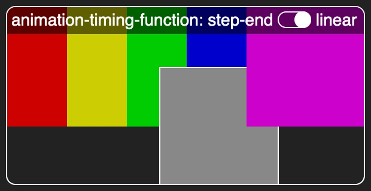](https://MERNCraft.github.io/timing)
This demonstration uses the following `@keyframes` animation:
```css
@keyframes z-left {
  0%  { z-index: 0; left:  0px; }
  10% { z-index: 1; left:  0px; }
  30% { z-index: 2; left:  50px; }
  50% { z-index: 3; left: 100px; }
  70% { z-index: 4; left: 150px; }
  90% { z-index: 5; left: 200px; }
 100% { z-index: 5; left: 200px; }
}
```
When you select `step-end` as the `animation-timing-function` for this animation, the integer steps for `z-index` coincide with the stepwise change of the `left` property for the grey square. When you select `linear` as the `animation-timing-function`, the value of `left` changes at a steady pace between keyframes. The change in `z-index` occurs when the grey square is halfway between two keyframe positions.

You can find a list of all animatable CSS properties [here](https://www.quackit.com/css/css3/animations/animatable_properties/). Most properties have an animation associated with them, and code that you can copy and paste.
#### Starting an animation

For now, to restart the animation, you have to click on the link to reload the page. Reloading the page will reset everything in your game, so you only want to do this if the player wants to start over from the beginning.

Here's a change you can make so that the animation will restart when you move your mouse over the `<a>` link element. I've given the complete CSS code, so you can compare with what you have in your project, but only a small part has changed.

Note that I have reduced the duration of the animation to just `1s`, because your time is precious, and you don't want to wait ten whole seconds to see the final result.
```css
body {
  counter-set: countdown 10;
}

a::after {
  content: counter(countdown);
  font-size: 50vmin;
}

/* animation rule moved to here... and made to run faster */
a:hover::after {
  animation: timer 1s forwards step-end;
}

@keyframes timer {
  0% { counter-increment: countdown   0; }
 10% { counter-increment: countdown  -1; }
 20% { counter-increment: countdown  -2; }
 30% { counter-increment: countdown  -3; }
 40% { counter-increment: countdown  -4; }
 50% { counter-increment: countdown  -5; }
 60% { counter-increment: countdown  -6; }
 70% { counter-increment: countdown  -7; }
 80% { counter-increment: countdown  -8; }
 90% { counter-increment: countdown  -9; }
100% { counter-increment: countdown -10; }
}

/* @keyframes timer {
   0% {  background-color: #f00; }
  10% {  background-color: #f80; }
  20% {  background-color: #8f0; }
  30% {  background-color: #0f0; }
  40% {  background-color: #0f8; }
  50% {  background-color: #08f; }
  60% {  background-color: #00f; }
  70% {  background-color: #80f; }
  80% {  background-color: #f0f; }
  90% {  background-color: #f08; }
 100% {  background-color: #f00; }
} */
```
Now, if you move your mouse over the text `Refresh Page`, or the `1` of the number `10`, the animation will start. If you move your mouse over the `0` of the number `10`, the CSS elves will start running around in circles. When the mouse is over the `0`, the animation will start, and they will replace the number `10` with the number `9`, which isn't so wide, so the mouse is no longer over the `<a>` link, so the animation will stop, and they will show `10` again, and restart the animation. Over and over.

Depending on which browser you are using, you may see the display flicker between `10` and `9`, or you may just see the cursor flicker between a pointer and an arrow.

#### Restarting when the state changes

If you hold the mouse in a place where the animation will run to the end, you should see a big `0`. If you then move the mouse away from the link, it will revert to showing `10`.

Before, it played all the way to the end, and then stayed at `0`. What has changed?

Before, the animation started as soon as the page was loaded. The page remained loaded after the animation finished, so the CSS elves left everything the way they were told to by the final `100%` keyframe of the animation. Now, when you move the mouse off the link, they consider the animation to be switched off again, and reset everything to its original state.

#### Pausing an animation

Instead of `:hover`, you can use the state of a checkbox or a radio button to change the state of an animation. Edit your HTML page so that it looks like this:
```html
  <input type="radio" name="play-state" id="play">
  <input type="radio" name="play-state" id="paused">
  <input type="radio" name="play-state" id="stop">
  <a href="/" class="refresh">Refresh Page</a>
```
Notice that there are three radio buttons which all appear before the `<a>` link. These radio buttons share the same `name` property, so only one can be on at a time, but they all have different `id` values.

In your CSS page, comment out the rule for `a:hover::after` and add a new rule for the radio buttons:
```css
/* a:hover::after {
  animation: timer 1s forwards step-end;
} */

input:checked ~ a::after {
  animation: timer 1s forwards step-end;
}
```
The selector `input:checked ~ a::after` uses the `~` sibling combinator. It says: "Apply the following rule to any `<a>` link where there is an `<input>` that is `:checked` with the same parent earlier in the HTML page". All the radio buttons appear before the  `<a>` link, so if any of them is checked, the `animation` rule will apply.

Refresh your page so that no radio buttons are checked, and then click any one of them. The animation plays to the end, and stops on `0`. Click on any of the other radio buttons.

Nothing happens.

The rules says: "If any  of the radio button `<input>`s  is `:checked`, play the animation. If not, stop the animation." So it doesn't matter which button is checked. They all agree with each other.

What happens if you specify that only the button with an `id` of `play` is to make the animation play? Try this:
```css
input#play:checked ~ a::after {
  animation: timer 1s forwards step-end;
}
```
Now, if you click on the first button, the animation plays to the end. If you click on one of the other buttons, the display reverts to showing `10`.

Add a ruleset for the `#paused` button, as shown below. (Note that I have reset the duration for both buttons to the same value of `10`, so that you have time to click on different buttons while the animation is in progress.)
```css
input#play:checked ~ a::after {
  animation: timer 10s forwards step-end;
}

input#paused:checked ~ a::after {
  animation: timer 10s forwards step-end;
  animation-play-state: paused;
}
```
This also plays the animation when it is selected, but it sets the [`animation-play-state`](https://developer.mozilla.org/en-US/docs/Web/CSS/animation-play-state) to `paused`. So if you refresh your page and then click the middle radio button, nothing happens. (The CSS elves are in fact busy, but they are busy doing nothing.) If you click on the left-most (`#play`) radio button, the animation will start. If you click on the middle (`#pause`) button, it will ... pause. You can continue the animation from this by clicking on the left-most button again. Or you can reset the counter to `10` by clicking on the right-most (`stop`) button.

#### Who owns the animation?

What happens if you comment out the line that makes the `#paused` play the animation:
```css
input#paused:checked ~ a::after {
  /* animation: timer 10s forwards step-end; */
  animation-play-state: paused;
}
```
If you start the animation with the first button and then click on the `#pause` button, the animation reverts to its initial state, just as if you had clicked on the `#stop` button. The `animation-play-state` no longer knows which animation it refers to.

Actually, I think that this version is more elegant:
```css
input#paused:checked ~ a::after,
input#play:checked ~ a::after {
  animation: timer 10s forwards step-end;
}

input#paused:checked ~ a::after {
  animation-play-state: paused;
}
```
Why? DRY! The duration of `10s` is defined in only one place. In the earlier version, you could set a different duration in each of the rulesets, and unexpected things could happen.

The selector that you use for the different rules must apply to exactly the same element. The animation "belongs" to that element. The selectors used can look very different, so long as they refer to the same animated element. These rules would also work:
```css
body:has(input#paused:checked) a::after,
input#play:checked ~ a::after {
  animation-name: timer;
  animation-duration: 10s;
  animation-fill-mode: forwards;
  animation-timing-function: step-end;
}

body:has(input#paused:checked) a::after {
  animation-play-state: paused;
}
```
The more complex selector for the `#paused` button means that it could now be anywhere in the HTML page, even after the animated element, or with a different parent:
```html
  <input type="radio" name="play-state" id="play">
  <input type="radio" name="play-state" id="off">
  <a href="/" class="refresh">Refresh Page</a>
  <div>
    <input type="radio" name="play-state" id="paused">
  </div>
```

#### Triggering a timeout

Now that you can create a countdown timer, the next step is to do something when the player's time runs out. If CSS were a programming language, you might do something when the value of the `counter` reaches `0`. But CSS is a styling language. It simply applies a series of rules to a basically static page. It _uses_ counters but it does not give you any way to _read the value_ of a counter, and certainly no way to compare one value with another.

The main focus of this article is counters, but to bring the story of a countdown to its logical conclusion, I'm going to have to leave counters aside for a moment, and talk about animations and other CSS properties. 

You've used the `forwards` value of the `animation-fill-mode` property, so whatever CSS rules are given by the last keyframe will persist after the animation has finished. To see this, add a new rule at the end of the `@keyframes timer`:
```css
@keyframes timer {
  /* 10 lines skipped */
  100% { counter-increment: countdown -10;
         color: red; /* new rule */
       }
}
```
Click on the `#stop` radio button and then on the `#play` button, and watch how the number `0` is now shown in red when the animation ends.

Can you see where this is going? Instead of simply changing the `color` of the animated element itself on the last keyframe, you can change something more radical which will affect other elements. It would be best to start a new project for this.

### Time to play:  A Race Against Time

I want to use CSS to tell a story of how one person can save the whole ~~world as we know it~~  browser from a ~~terrible~~ simulated threat, by clicking a button in a race against time. 

[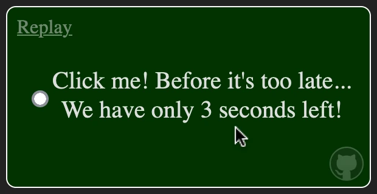](https://merncraft.github.io/countdown/)  
[Link](https://merncraft.github.io/countdown/)

Create a new HTML file with a linked CSS file. Here's the HTML that you can use:
```html
  <label>
    <input type="checkbox">
    <span></span>
  </label>
  <div>It was always too late.</div>
  <a href="/" class="refresh">Refresh Page</a>
```
You can make both the `label` and the `div` fill the entire browser viewport, with the `div` in front:
```css
label,
div {
  position: fixed;
  top: 0;
  left: 0;
  right: 0;
  bottom: 0;
  display: flex;
  justify-content: center;
  align-items: center;
  font-size: 7vmin;
}

div {
  background-color: #900;
}
```
The text "It was always too late" should now appear in dramatic black characters on an ominous red background. The mini-game that you can create will give the player the chance to prevent this terrible news from appearing.

The `<label>` with a transparent background is hidden behind this. However the <u>Refresh Page</u> link is also hidden behind the `<div>`, because of the use of `position: fixed`, which creates a new [stacking context](https://developer.mozilla.org/en-US/docs/Web/CSS/CSS_positioned_layout/Understanding_z-index/Stacking_context). To raise the link above the `fixed` elements, you have to give it a `position` other than `relative` or `static`:
```css
a {
  position: absolute;
}
```
#### Hiding and showing the message of doom
To hide the red `<div>` you can set its `display` to `none`. But you don't need to do this directly. You can use a custom CSS property with the value of `none`. Add a new rule, and a new line to the ruleset for the `div`:
```css

body {
  --display: none;
}

/* rule for label, div skipped */*

div {
  background-color: #900;
  display: var(--display);
}
```
You should now see a little lonely checkbox in the centre of your page. If you click on it, it becomes selected but nothing else happens. You can add a rule to change the value of the `--display` custom property. **This is not the rule that you are looking for**:
```css
input:checked {
  --display: flex;
}
```
You can try it anyway, but it won't work. Why not?

Which element is this custom property applied to? Which element _should_ it be applied to, so that the `div` rule can use it?

Try this instead:
```css
body:has(input:checked) {
  --display: flex;
}
```
Do you see the difference? In the first rule, `--display` was set for the `<input>` element. The `<div>` is not a child of the `<input>` element, so it cannot inherit the value of `--display`.

In fact, `<input>` elements cannot have any children. They are written with a single self-closing tag, so there is nowhere for a child to be added. And for this reason, they cannot have `::before` or `::after` pseudo-elements either. That's why I added an empty `<span></span>` element, which _can_ have children and `::before` and `::after` pseudo-elements, because that's what I'll use for storytelling.

The second rule, which uses the [`:has()`](https://developer.mozilla.org/en-US/docs/Web/CSS/:has) pseudo-class, allows me to select the `<body>` element, only if there is an `<input>` which is `:checked` as one of its children. When you check the checkbox, the _`<body>`_ gives its `--display` custom property the new value of `flex`, and the `<div>` is a child of the `<body>`, so it inherits this new value. And the red message fills the screen.

You can click on the <u>Refresh Page</u> link to make it disappear again.

#### Ten seconds until the end

Actually, so far you have created the exact opposite of the story I want to tell. I want to create a countdown where clicking this button will stop the red message from appearing. This is the ending I want your triumphant player to see:
```css
span::before {
  content: "My hero!";
  display: block;
}
span::after {
  content: "You saved us!"
}
```
You can use the same countdown timer that you used in the last exercise...
```css
@keyframes timer {
   0% { counter-increment: countdown   0; }
  10% { counter-increment: countdown  -1; }
  20% { counter-increment: countdown  -2; }
  30% { counter-increment: countdown  -3; }
  40% { counter-increment: countdown  -4; }
  50% { counter-increment: countdown  -5; }
  60% { counter-increment: countdown  -6; }
  70% { counter-increment: countdown  -7; }
  80% { counter-increment: countdown  -8; }
  90% { counter-increment: countdown  -9; }
 100% { counter-increment: countdown -10;
        --display: flex;
      }
}
```
... but instead of making the little harmless `0` turn red, this will turn the whole page red, as `--display` is set to `--flex` on the last keyframe.

If you add this to your CSS file, nothing will happen... yet. First you have to start the animation. So here's a question. The following rule will start the animation. Which element should it be applied to?

```css
animation: timer 1s step-end forwards;
```
I've used a very short duration (`1s`) for now, so that you will see immediately if the animation is working or not. Remember, the final value of `--display` needs to be applied to the `<div>`.  Would this work?
```css
div {
  animation: timer 1s step-end forwards; /* new rule */
  background-color: #900;
  display: var(--display);
}
```
You can try it. You can try putting the new `animation` rule at the end of the ruleset. But, no, it doesn't work.

It's not crystal clear why not. The official documentation talks about  ["animation-tainted" custom properties](https://www.w3.org/TR/css-variables-1/#animation-tainted), and discussions on the [W3C GitHub Issues pages](https://github.com/w3c/csswg-drafts/issues/411#issuecomment-890081098) show just how complex the interaction of custom variables and keyframe animations is. I use the principle of [(https://www.newscientist.com/definition/occams-razor/)] here. To paraphrase: if it doesn't work, don't look for anything more complex. Find a solution that does work.

So what happens if you apply the animation to the `<body>`instead?
```css
body {
  --display: none;
  animation: timer 1s step-end forwards; /* new rule */
}
```
Now the animation works. Now that you know that, you can set its duration to `10s` to give yourself time to stop the animation before it ends in tragedy.

#### Averting the impending disaster

My story needs two more elements to make it even a little bit interesting:
1. An indication that the end is coming
2. An action that will stop the animation.

You can use the `counter(countdown)` to indicate how much time is left:
```css
input:not(:checked) {
  & ~ span::before {
    content: "Click me! Before it's too late...";
  }

  & ~ span::after {
    content: "We have only " counter(countdown) " seconds left!";
  }
}
```
The selector `input:not(:checked)` adds greater specificity to the selector that acclaims the hero (`span::before`), so the span will show this text as long as the checkbox is not clicked. But `counter(countdown)` starts at `0` and then goes negative. How can you get it to start at `10`? You'll need to add something like the following rule somewhere. But where?
```css
counter-set: countdown 10;
```
If you place this in the ruleset for `body` then the value of `10` will be constantly reset. The animation will change it every second, sure, but then the CSS rules will be reapplied, starting from the beginning, and once again, the `countdown` will be reset to `10`.

You need to apply this rule to the _parent_ of the `<body>`. But isn't the `<body>` the final parent of all that you can see in your browser. Yes. the final parent of _all that you can see_. But even the `<body>` has a parent: the `<html>` tag.

You could add this rule...
```css
html {
  counter-set: countdown 10;
}
```
... and it would work. But there's also a pseudo-element `:root`, which slips in between `<html>` and `<body>`, and it is conventional to use that instead:
```css
:root {
  counter-set: countdown 10;
}
```
With this rule the countdown will be shown, and at `0`, the "It was always too late" message will be shown. If you click on the button to stop it, you just bring the end closer. That's because of the rule you added a while back. It's time to remove this:
```css
```css
body:has(input:checked) {
  --display: flex;
}
```
Now, if you click (anywhere) the checkbox will be checked, and you will be praised as a hero. But wait for the 10-second countdown to end, and the terrible red message will appear anyway.

You need to stop the animation.

Only you can do this. _You_ are the hero.

You need to tell the `<body>` to pause the animation when the checkbox is checked.

And here comes the twist in my story. You are not the hero after all. You just set up the situation so that you can _look_ like the hero.

Does that give you a clue as to how to solve this?

You need to set the `animation-play-state` to `paused` by default, and only set it to [whatever the opposite of `paused` is](https://developer.mozilla.org/en-US/docs/Web/CSS/animation-play-state) while the checkbox is _not_ checked. This means that you need to create a selector that selects the `<body>` only if the checkbox is not checked.

Here is your secret Bond-villain plan:
```css
body {
  --display: none;
  animation: timer 10s step-end forwards paused; /* new property */
}
```
You make the world safe. And _then_ you create the sense of danger with this new rule:
```css
body:has(input:not(:checked)) {
  animation-play-state: running;
}
```
And since you are now the villain, you can deselect the checkbox again, and let countdown continue. You can both save the world and let the end come anyway. 

Yes, but while you were doing this, the real hero (played by your non-evil twin) crept unseen into the HTML file and changed the `type` of the `<input>` from `"checkbox"` to `"radio"`. Once a solitary radio button is checked, it cannot be unchecked. The good guys win again! One person can save the world!

#### Final tweaks

The [online version](https://merncraft.github.io/countdown)of this mini story game contains some cosmetic improvements. In particular, if you let the countdown reach one second, your version of the game will say "We have only 1 *seconds* left!", with "seconds" in the plural even though there is only one.

[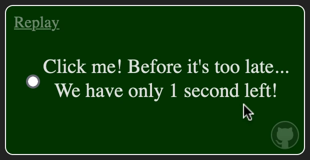](https://merncraft.github.io/countdown/)  
[Link](https://merncraft.github.io/countdown/)

In the online version, this infelicity has gone. How do you think I fixed it? Hint: [counters can count](https://merncraft.github.io/counter-styles/).

Also, if the text wraps, then the line break will not occur between the number and the word "second". For this I've used a non-breaking space, which for CSS needs to be written as `"\00a0"`. You can click on GitHub's Octocat logo to visit the repository where you can find the complete source.

### Animating a counter-style

Now you are ready to combine animating a counter and using a custom `@counter-style` at-rule. Here's a little puzzle where the challenge is not finding the combination of letters that opens the lock, but finding the order in which you need to change the letters. If you get the right word but don't get the right order, the CSS equivalent of an alarm goes off when you press Enter.

But you should know a little about me by now. I do like words to be spelt correctly, and to move the shortest distance between points. Of the 24 possible orders in which you can change each letter only once, only one meets my high standards.

[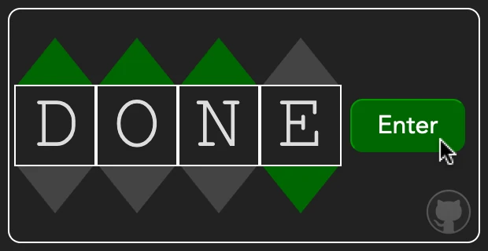](https://MERNCraft.github.io/lock)

This article is about counters, so I won't show you how to create the entire puzzle. I'll just show you how to animate the way the letters change. I'll get you to make a much simpler activity that uses this technique. If want to see how the order-of-execution logic was done, you can check out the [GitHub repository](https://github.com/MERNCraft/lock).

It's time to start a new project with a basic HTML page linked to a CSS file, just like you've done before.

#### Before...

You're going to be animating two counters, using upper-case letters instead of numbers. The animation will start when you check a checkbox input. Figure 15 below shows what I want your page to look like in a browser. Do you think you can create this on your own, without looking at the HTML and CSS below?

Do your best! You can compare your version with mine later, and see if yours was in fact more elegant : )

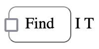
Figure 15.

Here are some things to think about:

- How to show the value of a counter
- How to set the initial value of a counter
- How to display a counter using upper-case letters
- How you will (eventually) hide the checkbox input
- How you can make a label look like a button

Here's the HTML that I used:

```html
  <label>
    <input type="checkbox">
    Find
  </label>
  <span></span>
```
And you'll see below the CSS that I started with. Note that you names for built-in counter styles is case-insensitive.
```css
body {
  counter-set:
    letter-one 9
    letter-two 20
  ; 
}

label {
  padding: 8px 16px;
  border: 1px outset #888;
  border-radius: 8px;
  display: inline-block;
}

input {
  position: absolute;
  left: 0vw
}

span::before {
  content: counter(letter-one, upper-alpha);
}

span::after {
  content: counter(letter-two, UPPER-ALPHA)
}
```
I imagine that you will have used different names for your classes and counters. You might have used a different selector to hold the `counter-set` rule. You might have used two elements to show the letters `IT`, each with its own `::before` or `::after` pseudo-element.

That's good. If _your_ CSS creates a similar effect to mine, don't change it. If your CSS is different now, that means that you will have to adapt the CSS that I provide below so that it works with yours. And that means that you might make mistakes which you will have to correct. And each mistake that you learn how to correct helps you to remember what you have learnt.

I've used `left: 0vw` for the absolute position of the input element. That means that it remains visible on the page for now. In production, I would set it to `-999vw` which will move it far off-screen to the left. The value I use is arbitrary; all that matters is that it is greater than the screen width of a checkbox.

If you want your label to behave more like a button when you hover your mouse over it or click, you can add a couple of cosmetic rules:
```css
label:hover {
  text-decoration: underline;
}
label:has(:checked),
label:hover:active {
  border-style: inset;
  background-color: lightgrey;
}
```
Now the label appears in a different state when the `<input>` that it contains is `:checked`.

#### ... and after

Now here's what I want your web page to look like after you check the checkbox:

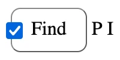
Figure 16.

Can you create two `@keyframes` at-rules, one to change the letter `I` into the letter `P`, and one to change the letter `T` into the letter `I`? And can you find a CSS selector and ruleset that will do the following?

- Detect when the `<body>` element contains a checked input
- Tell each of the `::before` or `::after` pseudo-elements which `@keyframes` animation to use

Here are the `@keyframes` at-rules that I used in my version:
```css
@keyframes letter-1 {
   0% { counter-increment: letter-one +0 } /* I */
  15% { counter-increment: letter-one +1 } /* J */
  29% { counter-increment: letter-one +2 } /* K */
  43% { counter-increment: letter-one +3 } /* L */
  57% { counter-increment: letter-one +4 } /* M */
  71% { counter-increment: letter-one +5 } /* N */
  85% { counter-increment: letter-one +6 } /* O */
 100% { counter-increment: letter-one +7 } /* P */
}

@keyframes letter-2 {
   0% { counter-increment: letter-one  -0 } /* T */
   9% { counter-increment: letter-two  -1 } /* S */
  18% { counter-increment: letter-two  -2 } /* R */
  27% { counter-increment: letter-two  -3 } /* Q */
  36% { counter-increment: letter-two  -4 } /* P */
  45% { counter-increment: letter-two  -5 } /* O */
  54% { counter-increment: letter-two  -6 } /* N */
  63% { counter-increment: letter-two  -7 } /* M */
  72% { counter-increment: letter-two  -8 } /* L */
  81% { counter-increment: letter-two  -9 } /* K */
  90% { counter-increment: letter-two -10 } /* J */
 100% { counter-increment: letter-two -11 } /* I */
}
```
I _could_ have used the same names for the animations as for the counters. CSS will understand that `@keyframes letter-one` refers to something different from `counter(letter-one)`, but if I give them different names then you can see that the name of the animation and the name of the counter it increments _can_ be different.

I've used intervals that are not _exactly_ the same between each frame, just because I like to keep things as simple as possible. Also, I made the `T` to `I` animation run backwards through the alphabet, because it requires fewer changes.

Here's the CSS rule that I used to trigger the animations:
```css
body:has(:checked) {
  span::before {
    animation: letter-1 0.7s linear forwards;
  }
  span::after {
    animation: letter-2 1.1s 0.7s linear forwards;
  }
}
```
I used `0.1s` for each letter change, because I just want to see that the animation is working without wasting precious seconds. But I also made the first letter (`I` to `P`) complete its animation before the second letter started (`T` to `I`). I did this, just to illustrate that it is possible.

If you want to create an animation more like a flight information display system at an airport, you could use the following `@keyframe` animation and a different rule for the second letter, like this:
```css
@keyframes letter-3 {
   0% { counter-increment: letter-one  +0 } /* T */
   7% { counter-increment: letter-two  +1 } /* U */
  14% { counter-increment: letter-two  +2 } /* V */
  20% { counter-increment: letter-two  +3 } /* W */
  27% { counter-increment: letter-two  +4 } /* X */
  33% { counter-increment: letter-two  +5 } /* Y */
  40% { counter-increment: letter-two  +6 } /* Z */
  46% { counter-increment: letter-two -19 } /* A */
  53% { counter-increment: letter-two -18 } /* B */
  60% { counter-increment: letter-two -17 } /* C */
  67% { counter-increment: letter-two -16 } /* D */
  73% { counter-increment: letter-two -15 } /* E */
  80% { counter-increment: letter-two -14 } /* F */
  86% { counter-increment: letter-two -13 } /* G */
  93% { counter-increment: letter-two -12 } /* H */
 100% { counter-increment: letter-two -11 } /* I */
}

body:has(:checked) {
  span::before {
    animation: letter-1 0.7s linear forwards;
  }
  /* span::after {
    animation: letter-2 1.1s 0.7s linear forwards;
  } */
  span::after {
    animation: letter-3 1.5s linear forwards;
  }
}
```
If you've ever watched a (non-digital) flight information display system in an airport, you will know that they are noisy. And [noise is one thing that CSS can't do for you, at least not reliably](https://css-tricks.com/playing-sounds-with-css/). 

But there's no sound in space either... or [not in any space near us or any time soon](https://www.youtube.com/watch?v=uD4izuDMUQA&t=952s). So perhaps when you are planning your own epic CSS game, you could set the story in space? Or [collaborate with a deaf community near you](https://play.deafverse.com/world/1)?

Notice that in the `@keyframes letter-3` rule above, the `increment` value jumps from `+6` for `Z` to `-19` for A. The built-in`upper-alpha` counter uses `system: numerical` in its definition. That means that the value `27` will be represented as `AA`, which is not what you want. Try it and see. Change the values that you use in your `counter-set` rule to something like this:
```css
body {
  counter-set:
    letter-one 0
    letter-two 27
  ; 
}
```
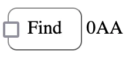
Figure 17.

#### Running an animation backwards

Right now, if you deselect the checkbox, the display jumps back immediately to showing `IT`. There's no reverse animation.

[Nikola Đuza at Pragmatic Pineapple](https://pragmaticpineapple.com/smoothly-reverting-css-animations/) has some good suggestions on how to make animations play smoothly in reverse, but none of them are helpful here.

If you look at the documentation for [`animation-direction`](https://developer.mozilla.org/en-US/docs/Web/CSS/animation-direction), you'll see that one of the options for the value is `reverse`. You might think, like I did, that it would be easy to use this value with the `@keyframe` animations that you have already created. After trying, trying and trying this again and again, I have had to use a more brute-force solution. (If you find a better one, [let me know](https://github.com/MERNCraft/css-only-games-1/issues/new.)

My solution was to make an exact copy of  my `@keyframes letter-1` and  `@keyframes letter-2` animations. I called them  `@keyframes letter-4` and  `@keyframes letter-5`. (I won't show them here, they are exactly the same as the animations you can find above, but with different names.)

I added this rule to my CSS:
```css
body:has(:not(:checked)) {
  span::before {
    animation: letter-4 0.7s linear reverse forwards;
  }
  span::after {
    animation: letter-5 1.5s linear reverse forwards;
  }
}
```
If you try this for yourself, you'll see that it has an unwanted side effect. Because the checkbox starts off unchecked, this `reverse` animation plays immediately after the page is loaded. What I needed was a third state, which would not trigger any animations at the start.

Can _you_ think of any three-state solutions? There's a hint in the subtitle below. See if you can find a solution for yourself before you read on.

#### Radio buttons are off by default

Consider this arrangement of radio buttons:
```html
  <label>
    <input type="radio" name="play" id="find">
    Find
  </label>
  <label>
    <input type="radio" name="play" id="lose">
    Lose
  </label>
```
Both buttons share the same `name` property, so only one can be on at any given time. Two states. But... both can be _off_ when the page is first loaded. A third state, for free!

So what CSS would you use with this? Notice that the radio buttons have different `id` values. Comment out your existing rules for `body:has(...)` and add this new one:
```css
body:has(#find:checked) {
  span::before {
    animation: letter-1 0.7s linear forwards;
  }
  span::after {
    animation: letter-2 1.1s linear forwards;
  }
}
```
(It's almost the same as the first one that I suggested, but both animations run at the same time.)

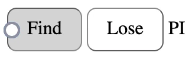
Figure 18.

On my screen, the Find label shows that its `<input>` has been `:checked`, but the radio button beside appears unchecked. Can you explain why? (Hint: How many radio buttons are there? What position has each been set to?)

If you click on the Lose button, once again the display jumps back immediately to showing `IT`. There's still no reverse animation. You'll need to add a new rule for `#lose:checked`.
```css
body:has(#lose:checked) {
  span::before {
    animation: letter-4 0.7s linear reverse forwards;
  }
  span::after {
    animation: letter-5 1.1s linear reverse forwards;
  }
}
```
#### Kill the spare

It would be nice to make this radio button pair behave like a single toggle checkbox... but with a third state. When the page is first loaded, you should see a button named "Find". When you click on it, its name should become "Lose". Or rather, it should be replaced by the Lose label.

The new rule below will hide whichever label contains a `:checked` radio button:
```css
label:has(:checked) {
  display: none;
}
```
However, it still shows both buttons at the start when neither of them is checked yet. Can you think of a second selector for the rule above to apply to? It should say something like: "If there is a label containing an unchecked radio button followed by another label containing an unchecked radio button, hide the second label."

You'll need to use a sibling combinator, like `~` or `+` to select the second label.

Here's my solution. Can you adapt this to work with your version?
```css
label:has(input:not(:checked)) + label:has(input:not(:checked)),
label:has(:checked) {
  display: none;
}
```

### Why 𝜋?

There is a reason why I chose to use PI for this exercise, other than that it is a two-letter word, so it's just enough for you to practise with. I had never really thought about CSS-only games until I found this puzzle on Wikipedia:

[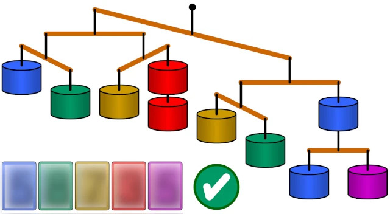](https://upload.wikimedia.org/wikipedia/commons/4/44/Balance_puzzle_SMIL.svg)

I've blurred the solution, so that you can enjoy solving the puzzle for yourself... but I not blurred it so completely that you can't read it if you look closely. So you can cheat if you want to.

My first thought when I saw this puzzle was: "There's no programming language in an SVG file! How is this even possible!" My second thought was: "I can reverse-engineer this 😈" And after I had done this, my third thought was: "So... I can do something like this in CSS, can't I?"

My very first CSS-only game used a technique like the one in this SVG file. I wanted to keep my game simple, so I wanted a solution that used only three numbers, and one of the most well-known three-figure numbers is 3.14.

When I had got my first version working, I thought: "Actually, CSS has better ways to do this than SVG has." And then (yes, five thoughts in a single day, and this is why you are here now): "Just _how many_ CSS techniques are there that could be repurposed or subverted or shoehorned into creating games?"

So: 𝜋 is where it all began.

And you'll notice that I haven't even finished with counters yet. There are plenty more topics in this field for me to cover.

### Counting clicks: take 2

This SVG puzzle allows you to cycle through the digits from `0` to `9` and then round to `0` again.

In the last exercise, you saw how to use just two radio buttons to cycle through just two different states (Find and Lose). Can you imagine how you could extend this technique to cycle through all the numbers from `0` to `9` and then start again from `0`?

>Ah. Technically, this exercise should not be in the Animations section, because it doesn't involve any animations.
>
>When I first planned this part, I had imagined that I would be able to use animation and two radio buttons, one on top of the other. My plan was to start with an animation which would repeatedly cycle through the digits `0` to `9`, but which started of `paused`. The animation would start `running` as soon as the top radio button was checked. When the animation reached the next keyframe, it would move the label for the other radio button in front, so the label for the `:checked` button would no longer generate a `:hover` pseudo-class. I would have a rule that would pause the animation if there was no `:hover` pseudo-class on the `:checked` button, so the animation would stop at the current number, and stay there until the radio button which was now at the front was clicked...
>
>Fiendishly clever, I thought. But only Firefox agrees with me. Safari doesn't update the `:hover` class until you move the mouse. And the Chrome CSS elves just shake their heads and say: "What!?"
>
>[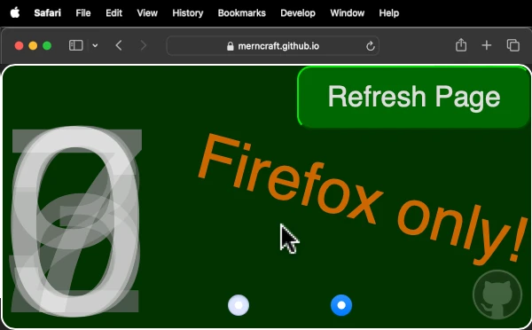](https://merncraft.github.io/stop-motion/)
>
>Try it for yourself in different browsers.
>
>I have included this failed attempt for a good reason, and not just because it took a lot of effort to get it to work at all. All progress takes effort. I learned that Safari, Chrome and Firefox all treat `:hover` in subtly different ways. Even though the concept was a failure, I learned something from it that I wouldn't have discovered if I had not tried and failed.

Sorry for the interruption. Back to my earlier question: **Can you imagine how you could extend the label-and-radio-button technique that you have just seen, to cycle through all the numbers from `0` to `9` and then start again from `0`?**

New HTML and CSS files. Here's some HTML to get started with:

Actually, the more I think about this, the more solutions I can imagine for this problem. So if you find a solution that is very different from mine, well: yours is right too.

Here's the HTML for the first solution that I tried: 
```html
<input type="radio" name="d" id="d0" checked>
<input type="radio" name="d" id="d1">
<input type="radio" name="d" id="d2">
<input type="radio" name="d" id="d3">
<input type="radio" name="d" id="d4">
<input type="radio" name="d" id="d5">
<input type="radio" name="d" id="d6">
<input type="radio" name="d" id="d7">
<input type="radio" name="d" id="d8">
<input type="radio" name="d" id="d9">
<label for="d1">1</label>
<label for="d2">2</label>
<label for="d3">3</label>
<label for="d4">4</label>
<label for="d5">5</label>
<label for="d6">6</label>
<label for="d7">7</label>
<label for="d8">8</label>
<label for="d9">9</label>
<label for="d0">0</label>
```
With no CSS, this creates a line of 10 checkboxes, followed by the digits `1234567890` in the same order as on the keyboard. Note, though that the _first_ input is checked, and this is the input with`id="d0"`. The input for `0` is at the beginning, but the `<label for="d0">` is at the end.

I want to show only two labels at any one time:

- The label which is `for` the `:checked` input. This should be visible.
- The label which is `for` the input with the next number in the cycle. This should be:
	- Invisible
	- In front of the label `for` the `:checked` input.

If I use `position: absolute` for all the labels, they will all appear one on top of each other, with the `<label for="d0">` immediately under the mouse. I'll make everything really big, so it's easy to click on the numbers:
```css
label {
  /* Cosmetic */
  --size: 100vmin;
  width: var(--size);
  height: var(--size);
  font-size: var(--size);
  text-align: center;

  /* Logical */
  position: absolute;
}
```
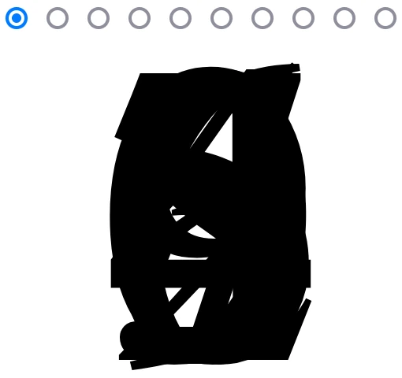
Figure 19.

I won't show the `/* Cosmetic */` CSS any more, but you might like to keep it in your project anyway.

I need to put the `<label for="d1">` in front of the `<label for="d0">`. If I set the `z-index` for all the labels —except for `<label for="d0">`— to `1`, then a click on what seems to be the `0` will in fact be a click on the`1`. 
```css
label {
  position: absolute;
  z-index: 1;
  display: none;
}

#d0:checked ~ [for=d0] {
  display: block;
  opacity: 1;
}

#d0:checked ~ [for=d1] {
  display: block;
  opacity: 0;
}

[for=d0] {
  z-index: 0;
}

#d9:checked ~ [for=d0] {
  z-index: 1
}
```

With the CSS shown above, if I click on the `0`, `<input id="d0">` will no longer be checked, but `<input id="d1">` will be checked instead. I now want `<label for="d1">` to be visible, with `<label for="d2">` in front of it, but invisible. I can do this by adding an additional selector to each of the rulesets that set both `display` and `opacity`.

```css
#d1:checked ~ [for=d1],
#d0:checked ~ [for=d0] {
  display: block;
  opacity: 1;
}
#d1:checked ~ [for=d2],
#d0:checked ~ [for=d1] {
  display: block;
  opacity: 0;
}
```
Indeed, I can apply the same logic all the way up to 9:
```css
label {
  position: absolute;
  z-index: 1;
  display: none;
}

#d9:checked ~ [for=d9],
#d8:checked ~ [for=d8],
#d7:checked ~ [for=d7],
#d6:checked ~ [for=d6],
#d5:checked ~ [for=d5],
#d4:checked ~ [for=d4],
#d3:checked ~ [for=d3],
#d2:checked ~ [for=d2],
#d1:checked ~ [for=d1], 
#d0:checked ~ [for=d0] {
  display: block;
  opacity: 1;
}
#d9:checked ~ [for=d0],
#d8:checked ~ [for=d9],
#d7:checked ~ [for=d8],
#d6:checked ~ [for=d7],
#d5:checked ~ [for=d6],
#d4:checked ~ [for=d5],
#d3:checked ~ [for=d4],
#d2:checked ~ [for=d3],
#d1:checked ~ [for=d2], 
#d0:checked ~ [for=d1] {
  display: block;
  opacity: 0;
}

[for=d0] {
  z-index: 0;
}
```
I can follow what happens in the Developer Tools Inspector:


Figure 20.

But when I get to `9`, I want the next click to apply to the `<label for="d0">`. In the Inspector, this label _appears_ to be in a higher layer than  the `<label for="d9">`, but just now, I set the `z-index` of every label _except_  the `<label for="d0">` to `1`, so that I could click on  the `<label for="d1">` instead.  Now I'll need one last rule to fix this for this one specific case:
```css
#d9:checked ~ [for=d0] {
  z-index: 1
}
```
Try it! You should be able to cycle through all the numbers.

This system has some advantages. At any time, I can use a selector which contains (say) `#d3:checked`, to check if the player is currently looking at a `3`. This makes it easy to apply other rules to other elements when you select the answer that I want you to select.

A major disadvantage is that you must click on the current number itself if you want it to increase. This is not an intuitive action. It would be better to have a specific button that says `+`. And if you add a `+` button, why not add a `–` button, too? But, wait a minute... how can you make two buttons that work in opposite directions?
#### A label with two wings

New HTML and CSS files. You know the drill. Here's some HTML to get you started:
```html
<label class="d0">
    <span class="m">–</span>
    <input type="radio" name="d" id="d0" checked>
    <span class="p">+</span>
  </label>
  <label class="d1">
    <span class="m">–</span>
    <input type="radio" name="d" id="d1">
    <span class="p">+</span>
  </label>
  <label class="d2">
    <span class="m">–</span>
    <input type="radio" name="d" id="d2">
    <span class="p">+</span>
  </label>
  <!-- Something is missing here -->
  <span class="display"></span>
```
This only gives you three labels. They have radio buttons with the `id`s `d0`, `d1` and `d9`, but this is enough for you to check if this creates some kind of cycle. You can add more labels with the same structure later.

Each label has two spans: one with the class `"m"` (for "minus"), one with the class `"p"` (for "plus"). Suppose `<input id="d1">` is checked. Can you write a CSS rule that will show _only_ the `.m` span for inside the `<label class="d0">` and the `.p` span for inside the `<label class="d2">`?

Note that if any child of `<label class="dX">` is clicked, the associated `<input id="dX">` will become checked. 

Here is the strict minimum that you need:
```css
label {
  display: none;
}

body:has(#d1:checked) {
  .d0 span.m { display: block }
  .d2 span.p { display: block }
}
```
And this is what it will look like **if you check the checkbox for `#d1`**:

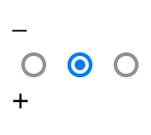
Figure 21.

If you click either the `–` or the +, a different checkbox will be checked, and the  `–` and the + will disappear. The CSS below has exactly the same _logical_ effect, but it just looks a bit bigger.

```css
body {
  /* Cosmetic */
  margin: 0;
  --size: 40vmin;
}

label span {
  /* Cosmetic */
  position: absolute;
  width: var(--size);
  height: var(--size);
  font-size: var(--size);
  text-align: center;
  border: 1px outset #888;
  border-radius: var(--size);
  top: 20px;

  /* Logical */
  display: none;

  /* Cosmetic */
  &.p {
    left: var(--size);
  }
}

body:has(#d1:checked) {
  .d0 span.m { display: block }
  .d2 span.p { display: block }
}
```
You can adjust this to suit your tastes.

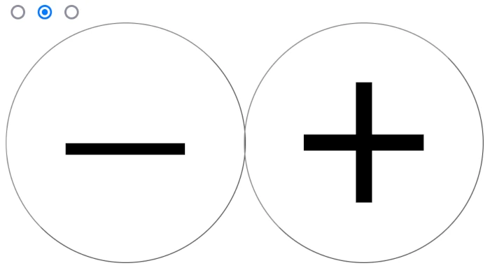
Figure 22.

#### Showing the value

The HTML I gave you includes this: `<span class="display"></span>`, but nothing is displayed in this span yet. I think you can guess that you can get it to display a `counter` in a `content` declaration. 

You could add a line to the ruleset for the `#d1:checked` button, and a new rule for the `span.display`:
```css
body:has(#d1:checked) {
  counter-set: digit 1; /* new declaration */
  .d0 span.m { display: block }
  .d2 span.p { display: block }
}

/* new rules */
span.display {
  font-size: var(--size);
}
span.display::after {
  content: counter(digit)
}
```
This would work. It would definitely work, but CSS won't let you read the value of a `counter`, except to display it in a `::before` or `::after` element. Is there a different CSS property that you could set... and then display the value of this different property? Hint: how did I set the _size_ of the spans that show the `–` and  `+` buttons?

How about this:
```css
body {
  --counter: 0; /* declare a custom property... */
  counter-set: digit var(--counter); /* ... and use it to set a counter */
}

body:has(#d1:checked) {
  --counter 1; /* set the custom property to a new value */
  .d0 span.m { display: block }
  .d2 span.p { display: block }
}
```
Custom properties have the advantage that they can be read from any child of the element in which they are declared. They can even be read by JavaScript. Try this in the Developer Console
```javascript
getComputedStyle(document.body).getPropertyValue("--counter")
```
>And if you are _really_ sneaky, you can even store JavaScript code inside a custom CSS property. The [official specifications for Custom Property Value Syntax](https://www.w3.org/TR/css-variables-1/#syntax) explicitly requires browsers to make this possible. ( See "EXAMPLE 7")

You can't _show_ the value of a custom property directly, but if it is a number, then you can use it with `counter-set`, and then get a _`counter`_ to display it for you.

#### Repeating a pattern

You want to be able to cycle through the numbers `0` to `9`, but for now, you can only show the number `1` (if the right radio button is checked). You need more labels with spans and radio buttons in your HTML page...
```html
  <label class="d0">
    <span class="m">–</span>
    <input type="radio" name="d" id="d0" checked>
    <span class="p">+</span>
  </label>
  <label class="d1">
    <span class="m">–</span>
    <input type="radio" name="d" id="d1">
    <span class="p">+</span>
  </label>
 <label class="d2">
    <span class="m">–</span>
    <input type="radio" name="d" id="d2">
    <span class="p">+</span>
  </label>
  <!-- Add a label for 3 with the appropriate class and id for the input -->
  <label class="d3">
    <span class="m">–</span>
    <input type="radio" name="d" id="d3">
    <span class="p">+</span>
  </label>
  <!-- Continue the sequence up to 9 (4-8 are skipped here) -->
  <label class="d9">
    <span class="m">–</span>
    <input type="radio" name="d" id="d9">
    <span class="p">+</span>
  </label>
```
... and you need more CSS rules, each with a similar pattern:
```css
body:has(#d0:checked) {
  --counter: 0;
  .d9 span.m { display: block } /* Notice that the "minus" span belongs to 0 */
  .d1 span.p { display: block }
}
body:has(#d1:checked) {
  --counter: 1;
  .d0 span.m { display: block }
  .d2 span.p { display: block }
}
body:has(#d2:checked) {
  counter-set: 2;
  --counter: 2;
  .d1 span.m { display: block }
  .d3 span.p { display: block }
}
/* And so on, up to 9 ... which is a little bit different */
body:has(#d9:checked) {
  --counter: 9;
  .d8 span.m { display: block }
  .d0 span.p { display: block }
}
```
Make these changes to your project, and then check if the plus and minus buttons work as expected. **Did you notice that the "plus" for 9 and the "minus" for 0 are different?** That's what makes the system cycle.

#### Next step: making a calculator

The technique that I have described here is exactly the same as the one I used to create the [Arithmetic in Pure CSS](https://merncraft.github.io/calc/) activity that you tried out at the beginning. It's true that the span "buttons" are a little more discreet there. There's also a little calculation that is done with the values of the custom CSS properties that hold the digit values, and a little trick to show `NaN` if you try to divide by `0`. But you should be able to reverse engineer everything that I did there... and if you get stuck you can always visit the GitHub repo and see all the CSS for yourself.

### Using an animation to cycle a list smoothly

## Incrementing with `:hover`


# Complete a Game by Adding Counters

I wrote at the beginning of this article that I would not be showing you, step by step, how to build a particular game. However, I do want to give you the chance to test whether my explanations have made good sense to you.

I've created a game that uses the techniques that I have described above. You can find the GitHub Repository [here](https://github.com/MERNCraft/path).

[](https://MERNCraft.github.io/path/)  
[Link](https://MERNCraft.github.io/path/)

If you clone the repository and launch the game on your own computer, you will find that the scoring and timing system is missing. Using the knowledge that you have just acquired, can you get your local version of the game to behave the same as the online version?

The logic of the game (starting and stopping it, picking up the gold tokens, showing the result when you reach the end) is already written. You'll find the CSS for this in a file called `styles.css`. You should not need to change anything in this file or in the `index.html` file.

There is a second CSS file attached to the HTML page. It's called `counters.css`, and it currently contains no CSS at all. You should now be able to write CSS of your own that:
- Shows the score
- Shows an emoji that gets happier as the score increases
- Shows how many seconds have passed since the player clicked on the green Start button
- Stops the timer when the game is over.
  
And of course, you can use this as the starting point for your own remixed version of the game. I'm sure that, artistically, your CSS power does exceed my own...
